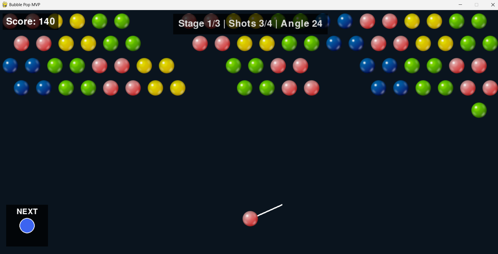

---
# Bubble Pop Game

Python pygame 기반의 버블 슈터 게임


---

## 빠른 시작 방법 

```bash
git clone https://github.com/gzntzz/bubble-pop-game.git
cd bubble-pop-game
pip install -r requirements.txt
python src/main.py
```

**조작법**: `← →` 각도 조절 | `Space` 발사

---

## 주요 기능


- **육각형 격자 시스템**: 홀/짝 행 오프셋 활용한 여섯 방향 이웃 탐색
- **물리 엔진**: 발사 각도 계산, 벽 반사 처리
- **DFS 알고리즘**: 같은 색 버블 3개 이상 연결 시 제거함
- **난이도 조절**: 4발마다 버블 덩어리 한 줄씩 하강
- **3단계 스테이지**: 점진적으로 난이도 증가

---

## 팀 구성 및 역할 

**기획**  
- **민기**: PM, 프로젝트 진행 주도, MVP 설정, 에셋 제작
- **준호**: 발표 자료(PPT, 대본) 제작, UI 피드백

**개발**  
- **건택**: 프로젝트 관리 및 리포지토리 구축, 메인 개발

**디자인**  
- **예린**: UI/UX 디자인, 색상 팔레트, 레이아웃 설계
- **민기**: UI 레이아웃, 대지 세팅

자세한 내역은 [CONTRIBUTORS.md](CONTRIBUTORS.md)를 참고하세요.

---

## 프로젝트 구조 

```
bubble-pop-game/  
├── src/  
│   ├── main.py         # 게임 메인 로직 (게임 루프, 충돌 처리, DFS)
│   └── skeleton.py     # 초기 설계 구조
├── assets/  
│   ├── images/         # 버블, 대포, 배경 등 게임 에셋
│   └── sounds/         # 사운드 파일 (예정)
└── docs/               # 프로젝트 문서 (예정)
```

---

## 기술 스택

- **언어**: Python 3.11
- **라이브러리**: Pygame 2.5.2
- **알고리즘**: DFS (깊이 우선 탐색)

---

**MIT License** | Made by **Team 언빌리버블**
